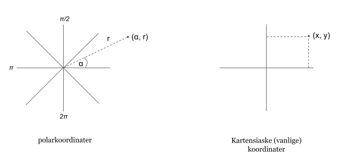
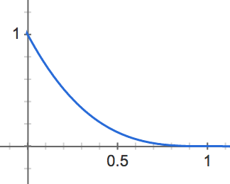
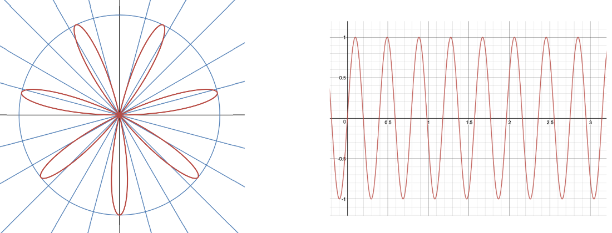
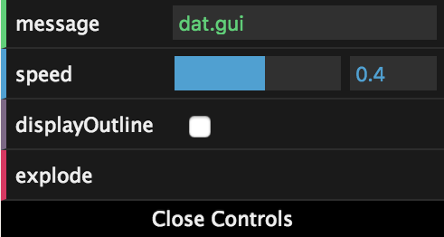

## Fragment Shader

> Interaktiv stjerne

I denne oppgaven skal vi bruke en fragmentshader til å lage en fin stjerne med interaktive kontrollere:


### Utdelt oppsett

I mappen `oppgave-4-fragment-shader` finner du et oppsett som ligner det vi lagde på dag 1, men uten noe innhold. Her skal du skrive koden for denne oppgaven. Det finnes en `fragmentshader.glsl`, hvor mesteparten av koden skal skrives, og den velkjente `index.js` som binder det hele sammen, pluss en enkel `vertexshader.glsl` som kun er med fordi den trengs for å få fragmentshaderen til å snurre. Det blir mer om vertexshadere i neste oppgave.

Du kjører koden i denne mappa med kommandoen

```sh
npm run start4
```

Den utdelte koden har en gjennomsiktig gul `PlaneGeometry` oppå en fin stjernebakgrunn. I løpet av oppgaven skal vi forme denne gule firkanten til en stjerne.

### Teori

Siden det er flere dager siden forrige gang kan det være greit å friske opp [teorien fra siste oppgave den forrige kursdagen](https://github.com/bekk/3d-visualisering-kursserie/tree/master/dag1#teori) før man går videre.

### Anatomy of a star

For å tegne stjernen vil vi bruke polarkoordinater. Da kan vi ha forskjellige intensitet i sentrum, og vi kan ha stråler som varierer med vinkelen rundt sentrum.



`position` er et punkt i det vanlige 3D-koordinatsystemet, såkalt kartesisk system. Og den matematiske formelen for å konvertere kartesiske koordinater til polarkoordinater er:

```c
polarkoordinater(x, y) = (
    sqrt(x*x + y*y), // sqrt er kvadratrot
    atan(y / x) // atan er arctangens
);
```

I den utdelte koden ligger x og y i `vertexPosition.x` og `vertexPosition.y`. Det er en vec2 som går fra (-1, -1) til (1, 1).

Siden `sqrt(x*x + y*y)` er lik lengden av vektoren kan vi bruke funksjonen `length()`:

```c
float radius = length(vertexPosition);
float angle = atan(vertexPosition.y / vertexPosition.x);
```

Og da kan vi endelig lage en sirkel ved å sette gjennomsiktigheten til maks utenfor en viss radius:

```c
float coreSize = 0.1;
float alpha = radius < coreSize ? 1.0 : 0.0;
```

Nå har du en enkel ensfarget ball.

### Sexify

For å få det riktig fint skal vi legge til glød på stjernen vår. En bra glød starter intenst og så faller av brått:



Vi starter med å regne ut et praktisk tall som sier hvor langt unna ytterkanten av stjernens kjerne vi er:

```c
float glowDistance = clamp(radius - coreSize, 0.0, 1.0);
```

`clamp(x, a, b)` er en funksjon som returnerer x, med mindre den er mindre enn a, da får man a. Eller med mindre den er større enn b, da får man b. Så med andre ord er man garantert å få noe mellom a og b. Praktisk for å unngå feil tall, slik som når radius er mindre enn coreSize.

Nå kan vi øke beregne glow som inverse av denne avstanden, og legge den til alpha slik at fargen kommer frem i gløden:

```c
float glow = 1.0 - glowDistance;
alpha += glow;
```

Dette er jo lineær avtagende glød, som ikke er så pent. Vi ønsker at den avtar litt mer eksponentielt, og en lett måte å oppnå det er å opphøye tallet i f.eks. 3:

```c
float glowFalloff = 3.0;
glow = pow(glow, glowFalloff);
```

La oss parameterisere intensiteten videre ved å gange det hele med et tall:

```c
float glowIntensity = 0.9;
glow *= glowIntensity;
```

Stjernen vår er fin, men føles det som den blender deg? Nei, det er litt flat gulfarge, men ingen blendende supernova. Et supertriks her er å øke alle farge-elementene for å få hvitere farge nærmere sentrum:

```c
float brightness = 0.9;
color += glow * brightness;
```

### Let there be beams

Siste prikken over i-en blir stråler som skinner ut av stjernen. Her kan vi bruke `angle` fra polarkoordinatene. Hvis intensiteten er en sinusbølge får vi pene stråler:



Vi regner ut et `wave`-tall som er sinusbølgen av polarkoordinat-vinkelen:

```c
float nofBeams = 6.0;
float wave = sin(angle * nofBeams);
```

Her ser vi også en lett måte å kontrollere frekvensen til sinusbølger, nemlig å gange vinkelen med en konstant `nofBeams`.

Men, siden sinus er en verdi fra -1 til +1, får vi negative stråler også, og det vil vi ikke. Så vi clamper bølgen til 0.0 - 1.0:

```c
wave = clamp(wave, 0.0, 1.0);
```

Så øker vi bare alpha slik at strålene synes i samme farge som stjernen:

```c
alpha += wave;
```

Dette blir ganske voldsomme stråler, som du kan se. Så vi gjenbruker teknikken til å redusere glød utover med avstanden til kjernen:

```c
float beamFalloff = 1.0 - glowDistance;
float beamStrength = 0.075;
wave *= beamStrength * beamFalloff;
```

Nå har vi en komplett stjerne. De viktige parameterne ble

- `color`
- `coreSize`
- `glowIntensity`
- `glowFalloff`
- `brightness`
- `nofBeams`
- `beamStrength`

### Live-parametrisering med dat.GUI-kontrollpanel

Når man har så mange interessante parametre er det såklart ekstra fett å kunne manipulere dem live. Helt til slutt i denne oppgaven skal vi bruke biblioteket dat.GUI og `uniforms` til å lage et slikt kontrollpanel.

#### dat.GUI

dat.GUI er et lite bibliotek for å lage små kontrollpanel til prototyping:



For å bruke det importerer vi det og initialiserer en instans:

```javascript
const dat = require("dat.gui");

const gui = new dat.GUI();
```

Så legger vi til en parameter for coreSize. dat.GUI fungerer ved at den endrer verdien direkte på parameterobjektet, og man kan spesifisere min- og max-verdi for å få en slider mellom disse ytterpunktene:

```c
const parameters = {coreSize: 0.1};

gui.add(parameters, "coreSize", 0.02, 0.5); // min = 0.02, max = 0.5
```

Mer dokumentasjon for dat.GUI finnes her: http://workshop.chromeexperiments.com/examples/gui/#1--Basic-Usage

Nå får du opp en slik slider for coreSize. Men det skjer ikke noe man drar den. Det er fordi coreSize-verdien kun ligger i parameters-objektet. Vi må få den inn i shaderen.

#### Parametrisering av shaderen

I shaderen blir dette ganske enkelt. Vi må bytte ut hardkodet `coreSize` med en uniform:

```c
uniform float coreSize;
```

og legge til uniformen i `uniforms` som blir sendt til ShaderMaterial:

```javascript
const uniforms = {
  coreSize: { value: 0.1 }
};
```

Vi lager en funksjon for å oppdatere uniformene:

```javascript
function updateUniforms() {
  uniforms.coreSize.value = parameters.coreSize;
}
```

Og kaller den for hver render:

```javascript
function render() {
  requestAnimationFrame(render);

  updateUniforms();

  renderer.render(scene, camera);
}
```

Da kan vi styre størrelsen på stjernen live via kontrollpanelet.

Gjør det samme for å parametrisere alle de andre parameterne.

Tips: For å legge til color picker i dat.GUI bruker man `gui.addColor()` i stedet for `.add()`. Parameterverdien blir da en hex-string slik som `"#ff9500"`. Denne kan vi sende til en vec3-uniform via THREE.Color:

```javascript
uniforms.baseColor.value = new THREE.Color(params.baseColor);
```
