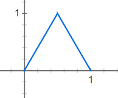
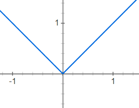
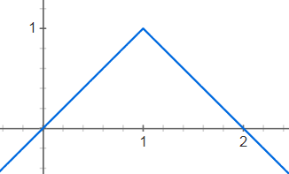

## Partikkelsystem

> Partikkelsystem

I denne oppgaven skal du benytte deg av GPU-ens enorme parallellitet for å visualisere tusenvis av partikler:


### Utdelt oppsett

I mappen `oppgave-6-particle-system` finner du et oppsett med den vanlige boilerplate-koden. Her skal du skrive koden for denne oppgaven. Du skal ikke bygge på den forrige oppgaven.

Du kjører koden i denne mappa med kommandoen

```sh
npm run start6
```

### Partikler i webgl

Partikkelsystemer fungerer ganske likt som vanlige geometrier og mesher. Men, det er kun vertices som brukes, og faces ignoreres. Hver vertex blir en partikkel med posisjon gitt av vertexshaderen, men i stedet for at fragmentshaderen fargelegger faces brukes den til å fargelegge en "flat" todimensjonal firkant der hver vertex position befinner seg på skjermen.

Three.js har en egen klasse `THREE.Points` for partikler som fungerer på akkurat denne måten. Vi legger den til `scene` som alle andre objekter:

```javascript
const points = new THREE.Points(geometry, material);
scene.add(points);
```

Materialet er faktisk helt likt som før. Og det er jo logisk siden vårt `ShaderMaterial` er helt rått uten definert oppførsel:

```javascript
const material = new THREE.ShaderMaterial({
  uniforms: uniforms,
  vertexShader: vertexShaderCode,
  fragmentShader: fragmentShaderCode,
  transparent: true
});
```

Geometrien er derimot litt spesiell. Vi lager en `BufferGeometry`, som er en helt rå geometri uten noe innhold. Rått er som vanlig bra. Vi vil rett på jernet her:

```javascript
const geometry = new THREE.BufferGeometry();
```

Den er så himla rå at vi til og med må allokere plass på GPU-minnet til posisjonene til alle verticene. I dette minnet er stort sett alt floats, og siden posisjonene er vektorer av tre floats må vi allokere 3 floats for hver partikkel. Vi setter antall partikler til 125 \* 125 som blir rundt femten tusen tilsammen:

```javascript
const nofParticles = Math.pow(125, 2);
const positions = new Float32Array(nofParticles * 3);
```

Vi bruker `Float32Array` i stedet for et vanlig javascript-array for å få 32-bit floats som GPU-en forventer. Et vanlig array ville bestått av javascript sin `Number` som er en brukervennlig klasse, men for lite spesifikk på hvor mange bits den okkuperer i minnet.

Til slutt spesifiserer vi selve allokeringen ved å legge til et `attribute` på geometrien. Tallet `3` her forteller webgl at floatene skal grupperes tre og tre, slik at de kan brukes som `vec3` i shaderen.

```javascript
geometry.addAttribute("position", new THREE.BufferAttribute(positions, 3));
```

Kommer det noe opp på skjermen? Nei. Årsaken til det er at det mangler en ny output fra vertexshaderen som vi ikke har brukt før: `gl_PointSize`. Den er i tillegg til den kjente `gl_Position`, og den sier hvor stor firkanten til hver vertex skal være på skjermen.

```c
float particleSize = 3.0;
gl_PointSize = particleSize * pixelRatio;
```

Nå har vi noe på skjermen. En enslig partikkel? Nei, det er jo alle femten tusen partiklene på samme posisjon oppå hverandre. På tide å flytte rundt på dem. Men først litt teori.

### Rutenett

Vi har lyst til å fordelen partiklene i et rutenett. For å holde ting ryddig lager vi en egen prosedyre for det:

```c
vec3 gridPosition() {
  // Her skal vi regne ut posisjonen
}

void main() {
  vec3 newPosition = gridPosition();

  ...
}
```

Hvis hver partikkel har indeks `vertexIndex`, og bredden på rutenettet skal være `w` er formelen for posisjonene ganske enkel:

```c
float x = mod(vertexIndex, w);
float y = floor(vertexIndex / w);
```

Hvor `mod` er matematisk modulo (rest) og `floor` gjør at et tall rundes ned til nærmeste heltall.

Bredden `w` er jo kvadratroten av det totale antall partikler hvis rutenettet skal være kvadratisk. Og i den utdelte koden er dette allerede sendt over til shaderen i en uniform `nofParticles`:

```c
float w = floor(sqrt(nofParticles));
```

Men hva med `vertexIndex`? Den har vi ikke. Siden dette er en rå shader må vi sende den over selv som et `attribute` på hve vertex.

```javascript
let vertexIndecies = new Float32Array(nofParticles);

vertexIndecies = vertexIndecies.map((element, i) => i);

geometry.addAttribute(
  "vertexIndex",
  new THREE.BufferAttribute(vertexIndecies, 1)
);
```

Den snedige `map`-onelineren fyller hvert element i lista med 0, 1, 2, 3, osv.

Vi må deklarere attributtet i shaderen for å bruke den, akkurat som uniforms:

```c
attribute float vertexIndex;
```

Nå kan vi returnere posisjonen til hver vertex. Siden posisjonen er 3d setter vi høyden til 0 og bruker `y` til dybden:

```c
return vec3(x, 0.0, y);
```

Der, et rutenett! Men det er to problemer:

- Det er ikke sentrert rundt origo (0, 0, 0)
- Alle prikker har samme størrelse, så prikker lenger unna er like store som de nærme

Vi løser det første problemet lett ved å trekke fra halvparten av bredden fra alle posisjonene:

```c
return vec3(x - w/2.0, 0.0, y - w/2.0);
```

Resultatet kan man se med en gang.

For å skape bedre dybdefølelse endrer vi `gl_PointSize` slik at blir mindre jo lenger unna kamera partiklene er. `gl_Position` inneholder x- og y-koordinatene på skjermen. Og z-koordinaten dens er dybden slik den er sett fra kameraet. Vi deler dermed partikkelstørrelsen på denne z-dybden. Siden dette dybdetallet er ganske høyt må vi øke partikkelstørrelse-tallet vårt ganske mye for å få noenlunde samme partikkelstørrelse nå som den er avhengig av dybden:

```c
float particleSize = 300.0;
gl_PointSize = particleSize * pixelRatio / gl_Position.z;
```

Resultatet er et pent rutenett av firkanter.

### Vi legger på bevegelse

La oss lage bølger! Hva er en bølge? Jo, det er sinus så klart. Vi øker høyden (y-koordinaten) for å lage bølger i x-retningen:

```c
float x = newPosition.x;

newPosition.y += sin(x);
```

Men de beveger seg ikke. En lett måte å flytte på sinus-bølger er å øke x-verdien, og vi har allerede en `uniform float time` med tiden i sekunder:

```c
float waveSpeed = 3.0;

x = x + time * waveSpeed;
```

Der ja. Nå har vi også en mulighet for å justere `waveSpeed` ved behov.

Vi ønsker større bølger. Både større bølgehøyde og bølgelengde. Heldigvis er det ganske lett å styre dette i et sinus-uttrykk. Bølgelengden økes ved å dele x:

```c
float waveLength = 10.0;

x = x / waveLength + time * waveSpeed;
```

Og bølgene blir høyere av å gange hele sinusbølgen:

```c
float amplitude = 3.0;

newPosition.y += amplitude * sin(x);
```

Nå har vi pene bølger.

### Fra firkanter til prikker

Vi har ikke gjort noe med fragmentshaderen enda. Den spytter kun ut fargen hvit for alle piksler til hver partikkel:

```c
gl_FragColor = vec4(1.0); // Kun ett argument (1.0) oversettes av webgl til (1.0, 1.0, 1.0, 1.0)
```

Vi vil lage en prikk, så fargen skal være gjennomsiktig utenfor prikken, og solid innenfor. La oss fiske ut alpha-verdien så vi kan beregne den for seg selv:

```c
vec3 color = vec3(1.0);

float alpha = 1.0;

gl_FragColor = vec4(color, alpha); // Enda en snarvei, hvor webgl tar de tre dimensjonene i første argument og slenger på siste argument for å lage en firedimensjonal vektor
```

Hvis vi har hver piksels avstand til senter av partikkelen kan vi gjøre alt utenfor en viss radius gjennomsiktig. I oppgave 4 hadde vi pikselens koordinater fra en `varying vec2 vertexPosition`. Men for partikkelsystemer er det ikke mulig å gjøre det på samme måte fordi `varying` interpoleres mellom vertices i en face, mens et partikkelsystem har som nevnt ingen faces.

I stedet finnes det en egen global variabel `gl_PointCoord` som inneholder en `vec2` mellom (0, 0) og (1, 1) som sier hvilken koordinat nåværende piksel har i partikkelens firkant.

La oss se hva som skjer om vi setter alpha til å være lik lengden av `gl_PointCoord`:

```c
float radius = length(gl_PointCoord);
alpha = radius;
```

Hvis man ser nøøøye etter ser man at det ene hjørnet til hver partikkel ble gjennomsiktig. Det er fordi det er definert som (0, 0) i dette systemet. hvis vi trekker fra (0.5, 0.5) får vi dermed flyttet nullpunktet til senter av partikkelen:

```c
float radius = length(gl_PointCoord - vec2(0.5));
```

Men da får vi en radius som går fra 0.0 til 0.5. Så vi ganger med 2 for å får en normalisert radius mellom 0 og 1:

```c
float radius = 2.0 * length(gl_PointCoord - vec2(0.5));
```

Men da ser vi at det er gjennomsiktig i midten og hvitt på utsiden. Det er jo det motsatte av hva vi vil. Vi inverterer radiusen for å riktig resultat:

```c
alpha = 1.0 - radius;
```

Der ja. Fine prikker. Litt små da. Vi ganger med et tall for å få de litt kraftigere. Alpha vil automatisk clampes til mellom 0 og 1, så vi løper ingen risiko:

```c
float strength = 5.0;
alpha *= strength;
```

### Vi fargelegger

La oss få en smak av regnbuen med litt tilfeldige farger. La oss beregne alle fargene i javascript og sende dem over til GPU-en. Hver farge er en vektor av 3 floats for red, green og blue. Vi setter hver rgb til en tilfeldig verdi med `.map()`:

```javascript
let color = new Float32Array(nofParticles * 3);
color = color.map(Math.random);
geometry.addAttribute("color", new THREE.BufferAttribute(color, 3));
```

Disse fargene er jo `attribute` og dermed kun tilgjengelig i vertexshaderen:

```c
attribute vec3 color;
```

Men vi trenger dem i fragmentshaderen. Den typiske fremgangsmåten i den situasjonen er å lage en `varying` som fragmentshaderen kan lese, og så bare skrive verdien oppå den:

```c
attribute vec3 color;
varying vec3 colorForFragshader;

void main() {
    ...

    colorForFragshader = color;
}
```

Er det en hack? Nei, fordi GPU-en er optimalisert for å overføre data på denne måten. Performance er fortsatt king.

Husk å deklarere `varyingen` i fragmentshaderen også. Og så kan den brukes:

```c
vec3 color = colorForFragshader;
```

Voila! Vi har farger.

### Vi plukker opp de grønne

Fremtiden er grønn. Så vi ønsker å plukke ut og stille opp de grønne partiklene. Kanskje de symboliserer noe viktig, som miljø eller håp eller noe sånt. Det skal skje når man klikker med musen, så vi trenger å fange opp det og kommunisere det til webgl-animasjonen.

La oss starte med å bare finne de grønne partiklene så vi har noe å se på:

```c
bool isGreen = color.g > color.r && color.g > color.b; // .r er en snarvei for .x, og så videre for g og b. Praktisk for vektorer som er farger.
```

Inntil videre hardkoder vi høyden deres. Så får vi et grønt fast teppe oppå bølgene:

```c
if (isGreen) {
  newPosition.y = 20.0;
}
```

For å animere noe på uforutsigbare tidspunkt i webgl er det en generell smart teknikk å styre en tidsmåler-variabel i javascript, og så sende den rått til shaderne som reagerer på en funksjonell forutsigbar måte avhengig av den verdien.

Det vil si at timeren starter fastlåst på 0.0, som shaderen kan være programmert til å ignorere. Når javascript-koden oppdager at noe skal skje øker den timeren jevnt oppover helt til 1.0 som symboliserer slutten på hendelsen. Da resetter javascript-koden timeren til 0.0 igjen, og dermed er animasjonen til hendelsen ferdig. Det er fritt opp til shaderens kode å beregne hva den gjør for de ulike verdiene mellom 0 og 1.

Poenget med teknikken er at shaderen ikke trenger å vite hva _forrige_ verdi av timeren var. Den bare leser nåværende og kalkulerer sitt utseende fra det. Den trenger dermed også ikke å vite hva sin egen forrige utseende var. Dette er viktig fordi shaderne beholder ikke sine variabler fra bilde til bilde. Det er kun gjennom `uniforms` og `attributes` at noe kan huskes mellom rendringer.

La oss gjøre akkurat dette. Steg for steg såklart. Tilbake i javascripten må vi altså fange opp museklikk på canvasen og gjøre noe med det:

```c
function callback(event) {
   console.log("Du klikket!");
}

document.getElementsByTagName("canvas")[0].addEventListener("click", callback);
```

Prøv å klikke og se om det funker.

Planen vår blir altså å ha en timer-uniform `animationTime` som skal gå fra 0 til 1. For å kunne styre denne i javascript-koden lager vi to variabler til for om animasjonen er igang og hvilket tidspunkt det ble trykket:

```c
let animationStart = 0;
let animationInProgress = false;

const uniforms = {
    ...
    animationTime: {value: 0.0},
};
```

De to støttevariablene gir vi verdi når man har trykket:

```c
function callback(event) {
   animationInProgress = true;
   animationStart = new Date().getTime();
}
```

Og så lager vi en funksjon som skal oppdatere variablene i render-loopen:

```c
function updateAnimationTime() {
    // Noe smart her
}

const animate = function() {
    ...
    updateAnimationTime();
    ...
}
```

Hvis animasjonen er igang må vi kalkulere animationTime, hvis ikke er den bare 0:

```c
function updateAnimationTime() {
    if (animationInProgress) {
        let animationTime = // noe smart

        uniforms.animationTime.value = animationTime;
    } else {
        uniforms.animationTime.value = 0;
    }
}
```

Hvis animasjonen er igang blir `animationTime` tidsdifferensen siden `animationStart`. Vi deler på 1000 siden tidene i er i millisekunder, og så deler vi på en konstant som blir antall sekunder animasjonen varer.

```c
const animationLength = 2.5;
const now = new Date().getTime();

let animationTime = (now - animationStart) / 1000 / animationLength;
```

Men hvis animasjonen er ferdig, må vi sette timeren til 0 og skru av `animationInProgress`:

```c
if (animationTime > 1) {
    animationInProgress = false;
    animationTime = 0;
}
```

Sånn, la oss teste det med å skrive ut `uniforms.animationTime.value`:

```c
console.log(uniforms.animationTime.value);
```

Tilbake i vertexshaderen kan vi nå endelig bruke `animationTime` til noe lurt:

```c
uniform float animationTime;
```

Hvis vi øker høyden med `animationTime` vil partiklene løftes opp fra bølgene:

```c
if (isGreen) {
    float targetHeight = 20.0;
    newPosition.y += targetHeight * animationTime;
}
```

Men de løftes ikke _ned_ igjen pent. De bare hopper ned når det er ferdig. Det er fordi `animationTime` går som en koselig normalisert lineær graf:

> f(x) = x


Men vi vil ha en graf som ser mer slik ut:



La oss dedusere oss frem til den grafen. Et bra triks er å bruke absolutt verdi:

> f(x) = abs(x)



Dette ligner mer. Vi snur den på hodet:

> f(x) = -abs(x)


Og flytter den opp y-aksen:

> f(x) = -abs(x) + 1


Og flytter den til høyre på x-aksen:

> f(x) = -abs(x - 1) + 1



Der ja! Nesten. Men den går fra x=0 til x=2. Så vi ganger x for å skalere den langs x-aksen:

> f(x) = -abs(x \* 2 - 1) + 1


Perfekt! I shaderkode blir det:

```c
float movement = -abs(animationTime * 2.0 - 1.0) + 1.0;

newPosition.y += targetHeight * movement;
```

Nå driver de grønne og bølger seg når de er på toppen. Men de skal heller gå over til et flatt plan så vi kan se dem tydeligere. Så i stedet for å simpelthen øke høyden setter vi høyden til å være en interpolasjon mellom bølgebevegelsen og en fastlåst høyde. Lineær interpolasjon gjøres i webgl med `mix(fra, til, parameter)` hvor `parameter` er mellom 0 og 1:

```c
newPosition.y = mix(newPosition.y, targetHeight, movement);
```

Sånn, da blir de flate og fine! En siste ting for å legge prikken over i-en: easing. For at animasjonen blir mer elegant kan vi konvertere den lineære movement-parameteren til å gli inn og gli ut i henhold til en kubisk kurve:


Et raskt søk på internett gir oss en ferdig formel for ease-in-out i 2. grad:

```c
// Hvis t er mellom 0 og 1:
float easeInOutCubic(float t) {
  if (t < 0.5)
    return 4.0*t*t*t;
  else
    return (t-1.0)*(2.0*t-2.0)*(2.0*t-2.0)+1.0;
}
```

Og siden vi har vært så flinke til å normalisere ting mellom 0 og 1 kan vi bruke den direkte:

```c
movement = easeInOutCubic(movement);
```

Resultatet er en deilig visualisering!
