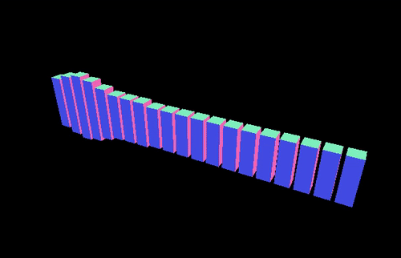

# Task 2: Dancing cubes!

You will now make your spinning cube into an ensemble of dancing cubes!



> This is just a suggestion. Your visualization might be very different, so just be creative!

## Before we start

If you did not quite get a grip on task 1, you can copy the suggested solution from `solutions/task1/index.js`. You can also take a quick look at how it looks by running:

```sh
npm run solution:1
```

## OrbitControls

The first thing we are going to do is to leverage a very useful module in `three.js`. [`OrbitControls`](https://threejs.org/docs/index.html#examples/controls/OrbitControls) provides us with a mouse controllable camera. Very similar to what you can find in 3D editors, making us able to zoom, rotate and move around the scene. Very neat if you "lose track" of an object somewhere 😅

To use `OrbitControls`, we have to load the module that contains it:

```js
const OrbitControlsModule = require("three-orbit-controls");
const OrbitControls = OrbitControlsModule(THREE);
```

Notice that `THREE` is passed as an argument to the module, so that the resulting constructor is bound to the same instance of `THREE` as the rest of the code.

Now that we have an `OrbitControls` constructor, we can connect it to our camera to enable mouse navigation.

```js
let controls;

controls = new OrbitControls(camera);
```

Try moving around in the scene using both left and right mouse button, and the mouse wheel.

## Multiply the cubes

To make an ensemble of dancing cubes, we need more cubes than currently in the scene. Also note that we will no longer provide you with every single piece of code that you need 👩‍🎓

There is no magic in `three.js` to do this, just old fashioned JavaScript. Let's revisit the code from task 1 to make a single cube:

```js
let geometry = new THREE.BoxGeometry(width, height, depth);
let material = new THREE.MeshNormalMaterial();
let cube = new THREE.Mesh(geometry, material);
```

You have to repeat this as many times that you want. If you prefer `for` loops or `forEach`/`map` is up to you. But it will be important to be able to reference each cube in the rest of the task, so save them in an array for later.

After you have done that, you should rewrite the code for the single rotating cube so that all the cubes are rotated.

## Positioning the cubes

Depending on how you solved the last step the cubes might be placed here and there, or they might be all on top of each other if they are given the same position.

You'll have to find a formula for the cube positions. You could give them each a position manually, but it will make it very complicated to change later.

Our suggestion is to make a function that calculates the position of a cube given the cube's index number in the line of cubes, and the starting position:

```js
const startPosition = -10;
const distanceBetween = 1.25;

// where cubeNumber is 0, 1, 2, and so on for each cube
let position = startPosition + cubeNumber * distanceBetween;

cube.position.x = position;
```

You can keep it simple and place the cubes along one of the axis (e.g. the X axis). But you can also be a little creative, as long as you are able to see all cubes.

You might need to change the starting position of the camera by moving it further out:

```js
camera.position.z = 40;
```

You will then see a bigger part of the scene, and hopefully all the cubes.

## Connect it to sound

This is where the fun part begins: Connecting input that changes things 🎶

We have made a little module that you can use to get input from the microphone on your laptop:

```js
const initAnalyser = require("./lib/soundanalyser.js");
```

This module is used in this way:

```js
init(); // Call init to set up things as normally

let analyser; // Save a reference to the sound analyzer

// Set up the analyzer with a callback
initAnalyser(function(a) {
  // When the initAnalyser function has connected to the microphone,
  // this code runs

  // You will get a reference to the analyser as parameter to the callback
  analyser = a;

  // You can then call the render function
  // kickstarting your render loop as before
  render();
});
```

> If you want to know more about how this microphone module works, you can scroll down to find an annotated version of the source code.

The `analyser` object returned from `initAnalyser` has a neat method called `analyser.frequencies()`. It gives you a list of decibel values for all the different frequencies the microphone records divided into a number of bins. The value of each bin is calculated using a Fast Fourier Transform (FFT), which in this case is set to divide the frequency range into `32` bins.

You can also get the maximum and minimum decibel your microphone can pick up like this:

```js
const maxDecibels = analyser.analyser.maxDecibels;
const minDecibels = analyser.analyser.minDecibels;
```

> There might be some quirks between different operating systems and runtimes. If you get very strange behavior, it might be better to simply use `0` and `255` as the min and max value.

These values can be used to normalize the frequency values. Normalizing means to transform given a number range to a standard `[0, 1]` range.

```js
function normalize(min, max, value) {
  return (value - min) / (max - min);
}
```

This function will return a number between `0` and `1` depending on how close `value` is to `min` and `max`. This is a very useful function in most visualization work.

Now that you have some numbers representing the recorded sound, we can hook this up to the cubes.

Let's replace the code that rotates the cubes with something that scales them instead according to the sound levels.

```js
let frequencies = analyser.frequencies();

function scaleCube(cube, cubeNumber) {
  let frequency = frequencies[cubeNumber];
  let scaleFactor = normalise(minDecibels, maxDecibels, frequency);

  cube.scale.y = scaleFactor;
}
```

This will scale your cube along the Y axis according to the `scaleFactor`, which is between `0` and `1`. You can also play around with this code 🤹‍♂️

If you have done things correctly, you will see the cubes dancing in the rythm of the sound the microphone picks up. Congratulations, you have a complete music visualization 👍

> If you have trouble making the microphone record, make sure you are on `localhost`, and not your computer's specific IP address. `localhost` is excempt from many of the security constraints of your browser.

We have some suggestions for things to change and play around with:

- Scale the cube in different directions
- Change the size of the cubes, perhaps you can make columns?
- Change the positions and spacing of the cubes

## Bonus material: The sound analyzer module explained

```js
// Use a third party module for web-audio
const createAnalyser = require("web-audio-analyser");

// Export a function from this module
// Optional options that enable more than 32 frequencies
module.exports = function initAnalyser(callback, options = { fftSize: 64 }) {
  // Ask the browser to use a mediaDevice
  // This is part of the WebRTC API
  navigator.mediaDevices
    // We only want audio, not video
    .getUserMedia({ video: false, audio: true })
    // If we are given access, we receive a stream object from the microphone
    .then(function(stream) {
      // We use the microphone stream to make an analyser
      const analyser = createAnalyser(stream, { stereo: false, audible: false });

      // Set the fftSize of the analyser according to options
      analyser.analyser.fftSize = options.fftSize;

      // We then call the callback given
      callback(analyser);
    })

    // If we cannot access the microphone, log an error
    .catch(function(error) {
      console.error(error);
    });
};
```
