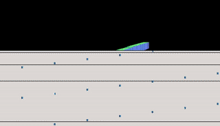

# Task 3: Fragment shaders



> This is just a suggestion. Your visualization might be very different, so just be creative!

Up to this point we've been using `three.js` built-in shaders (`MeshNormalMaterial` is actually a shader program), but when we want to get creative or do just about anything really interesting we have to write our own shader programs.

There are two kinds of shaders in WebGL, fragment and vertex, and they work together to calculate the value of all the pixels on the screen.

We will start by looking at the fragment shader, which is in charge of determining color.

## Before we start

If you did not quite get a grip on task 2, you can copy the suggested solution from `solutions/task2/index.js`. You can also take a quick look at how it looks by running:

```sh
npm run solution:2
```

## Background

Shader programs are written in a language of their own called GLSL. It is very similar to C and gets compiled and shipped down to the GPU to be executed. On the GPU it has its own memory space and runs separatly from the CPU and other stuff on the computer.

All the vertices and faces that make up geometries are loaded into the GPU and can be used as input to shader programs.

The shader programs are part of a rendering pipeline. The first step in the pipeline is the vertex shader, which runs its code once per vertex in a geometry (hence the name vertex shader). The next step is the fragment shader which runs once per pixel in the screen space coordinate system defined by the output of the vertex shader. The final step is what is visible on your screen.

## Passing data from JS to the GPU

In addition to vertices and faces, we can pass other kinds of data from our JS program to the GPU. Because the data is going into a GLSL-program, only datatypes compatible with GLSL can be passed. This means numbers, vectors, arrays and other primitives.

There are two ways to pass data into a shader: Uniforms and Attributes. In addition we can pass data between the vertex shader and the fragment shader using something called a Varying. This makes a total of three kinds of values available in shaders.

We'll get into Attributes in the next task, so for now we'll focus on Uniforms and Varyings.

A uniform is a value that is constant across all invocations of a shader program in a render. This is typically used for things like current time, textures or sound level. Values that are the same for all vertices in a geometry. Note that the uniforms can be changed between each fully rendered image, so they are not constant forever.

A varying is a kind of value that is assigned in a vertex shader and read in a fragment shader. It is helpful for passing along data derived from the current vertex. For instance the normal vector (the direction of up for a given vertex) or the texture value for the given vertex.

## Shader material

To use shader programs in our JS code we need to use a special kind of material from `three.js` [`ShaderMaterial`](https://threejs.org/docs/#api/en/materials/ShaderMaterial). This replaces the `MeshNormalMaterial` we've been using up to now.

```js
let material = new THREE.ShaderMaterial({
  fragmentShader: fragmentShaderCode,
  vertexShader: vertexShaderCode,
});
```

The `ShaderMaterial`-constructor takes the source code of the shader programs as its input. In order to make it a bit easier for ourselves and to avoid having glsl-code in strings in between our JS-code, we have added a little helper in the build-script that let's us read other files and store them in strings:

```js
const fs = require("fs");

const fragmentShaderCode = fs.readFileSync(
  __dirname + "/fragmentshader.glsl",
  "utf8"
);
const vertexShaderCode = fs.readFileSync(
  __dirname + "/vertexshader.glsl",
  "utf8"
);
```

> We will get into the contents of the vertex shader in the next task, so just use it as is for now.

## GLSL - the WebGL shader language

As a preparation to write our first bit of glsl-code, we will take a quick look at the syntax of glsl. As mentioned, it looks a bit like C and it has strict typing.

```glsl
// Examples of variable declarations

float a = 42.0;
float b = 42;  // This will produce an error, because ints are not floats
int c = 42;
bool d = true;

vec3 myVector = vec3(2.0, 1.5, 0.5); // This is a 3D vector. There are also 2D and 4D vectors, such as vec2 and vec4
float aCoordinate = myVector.x; // You can read components of vectors using .x|y|z|w or any combination of them
vec2 subVector = myVector.xy;

// You can declare procedures
float myProcedure(float t) {
  t = t - 1;
  return t*t*t + 1.0;
}

float myValue = myProcedure(2.3); //call the procedure
```

Glsl also has built in math operations, that are overloaded to work on numbers, vectors and matrices.

```glsl
float e = (a + c) / 23.0;

vec3 myVector = vec3(1.0, 1.0, 1.0);
vec3 longerVector = myVector * 3.0; // Vector multiplied with a scalar (x * 3.0, y * 3.0, z * 3.0)
vec3 dot = myVector * longerVector; // Dot product of two vectors

// We also have trigonometry and other helpful math functions
float f = sin(0.5); // sine
float g = pow(2.0, 8.0); // 2^8
```

You will find most mathematical operations built into glsl. A handy reference of all built-in functions can be found at [Shaderific](http://www.shaderific.com/glsl-functions/).

## `fragmentshader.glsl`

Let's get back to the code. Start by opening up the `fragmentshader.glsl`-file. In there you will find some simple code that defines the color of each pixel. Currently, the code will output white for everything.

```glsl
void main() {
    vec3 color = vec3(1.0, 1.0, 1.0);
    float alpha = 1.0;

    gl_FragColor = vec4(color, alpha);
}
```

Every shader program has a main function, which works as the entry point for the program. The main-function doesn't return a value, instead it assigns a value to the special variable `gl_FragColor` (another strange thing to chalk up to optimizations).

A `gl_FragColor` is a 4-dimensional vector containing the RGB-values and the alpha value of the color you want. You can try to tweak the numbers and observe how the output on the screen changes.

Let's try to change the alpha-value. But first, you will have to tell `three.js` that you have a transparent material. By default all materials are fully opaque, due to performance.

```js
new THREE.ShaderMaterial({
  ...
  transparent: true // Defaults to false due to performance
});
```

You can now change the alpha value in your shader and see the cubes turn transparent.

## Sending data to the shader

Now that we have a basic handle on how shaders work, let's try to pass some data into the shader. We are going to pass the current time of the animation into the shader. To do this we first have to record the current time when starting the program.

```js
let t0;

t0 = Date.now() * 0.01 // Current time in seconds
```

The `Date.now()`-function gives us the current time in milliseconds, so we multiply by `0.01` to get it in seconds. Now we can calculate how many seconds have passed since starting the program in our render-loop by recording a new timestamp and subtracting the initial time.

```js
let currentTime = (Date.now() * 0.01) - t0;
```

In order to send this information into the shader we need to declare a uniform. We do this by making an object that can hold the uniforms.

```js
let UNIFORMS = {
  time: { value: 0.0, type: 'float' }
}
```

We need to define the value of the uniform like this, because it will get translated into a glsl-value and glsl needs to know what kind of number we have.

We then pass that data to the shader material, letting WebGL know that we have some uniforms.

```diff
let material = new THREE.ShaderMaterial({
  vertexShader: vertexShaderCode,
  fragmentShader: fragmentShaderCode,
-  transparent: true
+  transparent: true,
+  uniforms: UNIFORMS
});
```

We can now access the uniform in our shader:

`fragmentshader.glsl`:
```diff
+uniform float time;

void main() {
  vec3 color = vec3(1.0, 1.0, 1.0);
-  float alpha = 1.0;
+  float alpha = sin(time);

  gl_FragColor = vec4(color, alpha);
}
```

Currently, everything will be black, since `sin(0.0)` is `0` giving us a fully transparent material. What we need to do is to change the value of the uniform each render.

```js
UNIFORMS.time.value = currentTime;
```

Doing this will give the uniform a new value each render, making the material blink quickly.

To slow down the blinking, we can multiply time by `0.1`.

`fragmentshader.glsl`:
```diff
uniform float time;

void main() {
  vec3 color = vec3(1.0, 1.0, 1.0);
-  float alpha = sin(time);
+  float alpha = sin(0.1 * time);

  gl_FragColor = vec4(color, alpha);
}
```

We still have the issue of sine oscillating between -1 and 1, spending about half the time below zero making the material fully transparent. We can make it oscillate between 0 and 1 instead, by applying the same trick we used to normalize the sound level.

`fragmentshader.glsl`:
```diff
uniform float time;

+float normalize(float min, float max, float value) {
+  return (value - min) / (max - min);
+}

void main() {
  vec3 color = vec3(1.0, 1.0, 1.0);
-  float alpha = sin(0.1 * time);
+  float alpha = normalize(-1.0, 1.0, sin(0.1 * time));

  gl_FragColor = vec4(color, alpha);
}
```

We now get a nicer oscillation of the transparency!

Next we will re-introduce some color by recreating the `MeshNormalMaterial` we used in previous tasks.

## Passing Normals

To recreate the `MeshNormalMaterial` we need the normals (it's kinda implied by the name). Fortunatly `three.js` provides normals for us, so all we have to do is to pass the normal from the vertex shader to the fragment shader.

In the `vertexshader.glsl`-file add the following code:
```diff
+varying vec3 normalVec;

void main() {
+  normalVec = normal;

  vec4 modelSpaceCoordinates = vec4(position.xyz, 1.0);
  vec4 worldSpaceCoordinates = modelViewMatrix * modelSpaceCoordinates;
  vec4 screenSpaceCoordinate = projectionMatrix * worldSpaceCoordinates;

  gl_Position = screenSpaceCoordinate;
}
```

This will ensure that a `varying` with the name `normalVec` is passed to the fragment shader.

`fragmentshader.glsl`:
```diff
uniform float time;
+varying vec3 normalVec;

float normalize(float min, float max, float value) {
  return (value - min) / (max - min);
}

void main() {
  vec3 color = vec3(1.0, 1.0, 1.0);
  float alpha = normalize(-1.0, 1.0, sin(0.1 * time));

  gl_FragColor = vec4(color, alpha);
}
```

It is important that the names of the `varying`-declarations match, otherwise no data will be passed.

## Recreate `MeshNormalMaterial`

We can now use the normal vector to change how we calculate the color.

`fragmentshader.glsl`:
```diff
uniform float time;
varying vec3 normalVec;

float normalize(float min, float max, float value) {
  return (value - min) / (max - min);
}

void main() {
-  vec3 color = vec3(1.0, 1.0, 1.0);
+  vec3 color = normalVec
  float alpha = normalize(-1.0, 1.0, sin(0.1 * time));

  gl_FragColor = vec4(color, alpha);
}
```

By using the normal vector as the RGB-component of our color we get this cool looking rainbow, with one glaring exception. There is a part of the object that is colored black. This is because at those vertices the normal vector has all negative components. To avoid this we can do some math to just ensure the vector stays inside the defined range for color.

`fragmentshader.glsl`:
```diff
uniform float time;
varying vec3 normalVec;

float normalize(float min, float max, float value) {
  return (value - min) / (max - min);
}

void main() {
-  vec3 color = normalVec
+  vec3 color = 0.5 * normalVec + 0.5;
  float alpha = normalize(-1.0, 1.0, sin(0.1 * time));

  gl_FragColor = vec4(color, alpha);
}
```

We now have dancing cubes which use our very own glsl-code!

Try playing around with some of the parameters:

- Change how we use the normal vector to set the color
- Try to calculate a distinct color some other way
- Try to pass other data as a uniform and use that to change color
