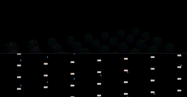

# Task 4: Vertex shaders



> This is just a suggestion. Your visualization might be very different, so just be creative!

Building on what we did with fragment shaders in the previous task, we will look at what we can do with vertex shaders.

## Before we start

If you did not quite get a grip on task 3, you can copy the suggested solution from `solutions/task3/index.js`. You can also take a quick look at how it looks by running:

```sh
npm run solution:3
```

## Background

Vertex shaders are responsible for placing every vertex in a geometry at its designated place.

The main responsibility of a vertex shader is to convert (or project) the model coordinate space into the coordinate space of the screen. This is usually done in three steps:

- **1:** Get the position of the vertex in the model coordinate space.

  This position is usually given as a uniform. In `three.js` it is provided for us by the framework.

- **2:** Project the model space coordinates into a common world space.

  This is done by using a `modelViewMatrix` and matrix multiplication. `three.js` provides a uniform containing the `modelViewMatrix` for this particular geometry.

- **3:** Project the world space coordinates into screen space.

  This is also done with a matrix. `three.js` provides a `projectionMatrix` as a uniform, same as with the `modelViewMatrix`.

This also happens to be the code which is already included in your `vertexshader.glsl`-file, which you had a quick look at in the previous task.

```glsl
varying vec3 normalVec;

void main() {
  normalVec = normal;

  vec4 modelSpaceCoordinates = vec4(position.xyz, 1.0);
  vec4 worldSpaceCoordinates = modelViewMatrix * modelSpaceCoordinates;
  vec4 screenSpaceCoordinate = projectionMatrix * worldSpaceCoordinates;

  gl_Position = screenSpaceCoordinate;
}
```

## More vertices is more fun

In addition to projecting the vertices into screen space, we can move vertices around before projecting them. Creating a sort of displacement effect.

The more vertices an object has, the more interesting the effect. Boxes, which we have been using up to now, have few vertices. In fact, a box only has 8 vertices (one for each corner). A more interesting object would be a sphere, which need to have alot of vertices in order to appear as a sphere.

So lets change our boxes into spheres by using a [`SphereGeometry`](https://threejs.org/docs/#api/en/geometries/SphereGeometry).

```diff
-let geometry = new THREE.CubeGeometry(1, 1, 1);
+let geometry = new THREE.SphereGeometry(1, 64, 32);
```

The different numbers in the `SphereGeometry`-constructor is the radius, the number of width-segments and the number of height-segments. The more segments, the more vertices the smoother the sphere. How many vertices to use is usually a performance vs appearance tradeoff. For this exercise using between `64` and `128` width-segments and between `32` and `64` height-segments should give you the desired appearance.

## Attributes

In the previous task we mentioned the different ways to pass data to a shader program and looked at how Uniforms worked. The other way to pass data into a shader is by using Attributes.

Attributes are attached to vertices, meaning we can have unique values per vertex. This is nice if we want to displace each vertex in some random way.

In order to attach values to vertices in a `three.js`-geometry we need to change from a normal geometry to a buffer geometry. As with so many things in the `three.js` (and WebGL) world, the difference between a normal geometry and a buffer geometry is mostly in its performance characteristics. The API and behavior is mostly the same.

```diff
-let geometry = new THREE.SphereGeometry(1, 64, 32);
+let geometry = new THREE.SphereBufferGeometry(1, 64, 32);
```

Now we can attach attributes to the geometry, which will become available in the shader program.

```js
let displacement = new Float32Array(geometry.attributes.position.count);
for (let i = 0; i < displacement.length; i++) {
  displacement[i] = Math.random();
}

geometry.addAttribute(
  "displacement",
  new THREE.BufferAttribute(displacement, 1)
);
```

This piece of code creates an empty `Float32Array`, which has the same length as the number of positions in the geometry. We also use the `addAttribute`-method on the geometry to add the values as a `BufferAttribute` with item size `1`, meaning each value of the array represents one value in the attribute. If we wanted to pass for instance color-values we would use an item size of `3`, meaning that 3 and 3 values represent one attribute-value (a vec3).

This piece of code will make the `displacement` attribute available in the vertex shader program and we can use it to displace the vertex.

`vertexshader.glsl`:
```diff
varying vec3 normalVec;
+attribute float displacement;

void main() {
  normalVec = normal;

+  vec3 displacedPosition = position + normal * displacement;

-  vec4 modelSpaceCoordinates = vec4(position.xyz, 1.0);
+  vec4 modelSpaceCoordinates = vec4(displacedPosition.xyz, 1.0);
  vec4 worldSpaceCoordinates = modelViewMatrix * modelSpaceCoordinates;
  vec4 screenSpaceCoordinate = projectionMatrix * worldSpaceCoordinates;

  gl_Position = screenSpaceCoordinate;
}
```

This will displace each vertex along its normal vector, which will create an interesting fuzzy look.

## Moving spheres

One of the benefits of using attributes is that we can make them change, kinda like we have done with uniforms, scale or rotation in the previous tasks.

We can get hold of the current displacement attribute on the sphere-object by doing this:

```js
let displacement = sphere.geometry.attributes.displacement;
```

We can then modify the attribute in any way we like. This piece of code will create a funky twirly displacement effect on the sphere when the frequency bin mapped to that sphere picks up a signal.

```js
spheres.forEach(function(sphere, i) {
  let f = normalize(min, max, frequencies[i]);
  let time = Date.now() * 0.01;
  let displacement = sphere.geometry.attributes.displacement;

  for (let j = 0; j < displacement.count; j++) {
    displacement.array[j] = f * Math.sin(0.1 * j + time);
  }

  displacement.needsUpdate = true;
});
```

There are a few things worth noting with this piece of code. Because the displacement attribute is wrapped in a `BufferAttribute`, we have to use `.count` to get the number of attributes and `.array` to access the underlying `Float32Array`.

We also have to tell `three.js` that we have updated the attributes by setting the `.needsUpdate` property to `true`.

You should now have a wobbly spinning colorful sphere thing which reacts to sound. Pretty neat!

This wraps up the workshop, but if you have time to spare here are some suggestions for things to experiment with:

- Add some noise to the displacement to produce a more interesting effect
- Try to change the displacement function to something other than sine
- Try to add other attributes for things other than displacement

## Dat.gui control panel elective

Now that you have reached 3D nirvana. We encourage you to try the english elective [Add dat.gui](https://github.com/holgerl/3d-visualization-workshop/tree/master/tasks/bonus-task.md) to have easy access to parameter tweaking.
